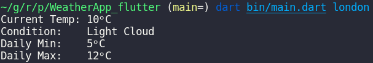

<details>
<summary>
<strong> Leia este guia em Português </strong>
</summary>
    <ul>
        <li><a href="./README-PT-BR.md"> Português </a></li>
    </ul>

</details>

# Weather App



A command line app that fetchs weather information using MetaWeather API.

### To run the app, simply write the following command:

```bash
dart bin/main.dart "city-name"
```

Replace the "city-name", eg, **dart bin/main.dart durban**

Visite the [MetaWeather](https://www.metaweather.com/) website for more information.
